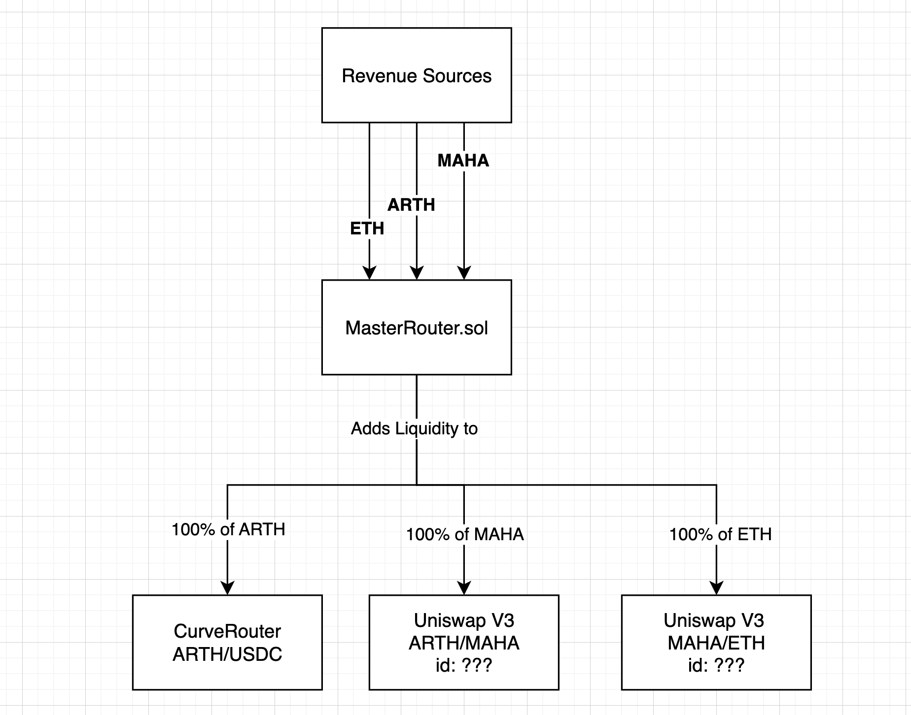

# ARTH Liquidity Contracts

These contracts focus on growing liquidity for the entire ARTH protocol from the protocol's revenue in an automated way.

Contracts get funded with ETH, ARTH, MAHA, USDT/C from the ecosystem's revenue and these tokens get added onto as liquidity into the protocol on a regular basis.

All LP tokens and positions get accumalated at the project's treasury.

Contracts are also keeper-compatible, which allows them to be automated using Chainlink automations or any keeper management software.

> :warning: **Contracts are not audited**: These contracts are not audited and are susceptible to high slippage attacks. Use at your own risks.

Treasury - [0x6357EDbfE5aDA570005ceB8FAd3139eF5A8863CC](https://etherscan.io/address/0x6357EDbfE5aDA570005ceB8FAd3139eF5A8863CC)

### MasterRouter.sol

This is the master contract where all the revenue gets collected. From here on, tokens gets split and sent to all the different routers below.

### CurveRouter.sol

Deployed Addresses

- ARTH/USDC Curve Router - [0xB1E961aC401A2cE5a267616C6843a3424c60b01c](https://etherscan.io/address/0xB1E961aC401A2cE5a267616C6843a3424c60b01c) - ([Curve Pool](https://curve.fi/#/ethereum/pools/factory-crypto-185/deposit))

This contract takes ARTH, adds liquidity to the curve pool and sends the minted LP token back to the treasury.

Curve automatically takes care of rebalancing our amounts so if we send a single sided asset, curve will automatically sell part of it and add both the assets into the LP pool.

### UniswapV3Router.sol

Deployed Addresses

- MAHA/WETH 1% Uniswap Router - [0x32fFE78b774990279456466f0eb6A08cF096bca5](https://etherscan.io/address/0x32ffe78b774990279456466f0eb6a08cf096bca5) - ([Uniswap Pool](https://info.uniswap.org/#/pools/0xb28ddf1ee8ee014eafbecd8de979ac8d297931c7))

This contract takes a single token (MAHA or WETH) and adds liquidity to the respective uniswap pool.

Uniswap unfortunately does not automate rebalancing amounts, hence we manually swap one asset for the other asset and try our best to add as much as possible into liqudity. Any leftover is refunded back to the caller.
